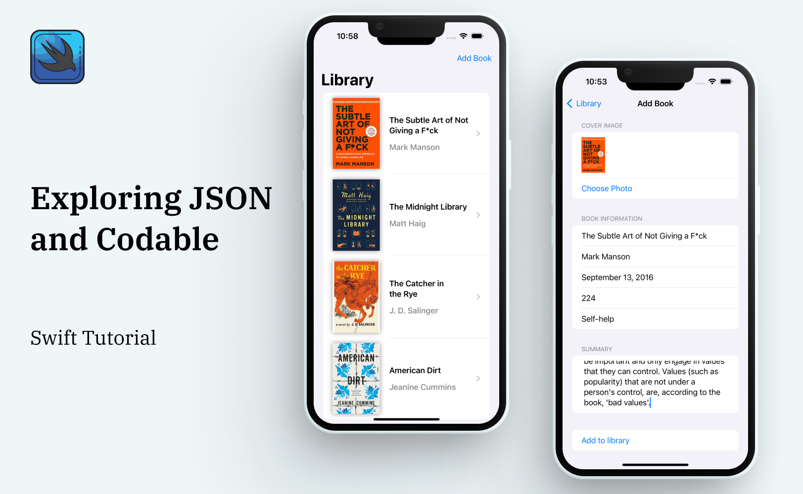

# Codable-Swift

This is a simple iOS application that demonstrates the use of Swift's Codable protocol for encoding and decoding data. 
The app allows users to manage a digital book library, adding new books and viewing existing ones.

<h3 align="center">

</h3>

## Features
* View a list of all books in the library
* Add a new book with information such as title, author, cover image, genre, summary and published date
* View details of a selected book, including its cover image

## Requirements
* Xcode 12 or later
* iOS 14 or later

## Installation
1. Clone or download the repository to your local machine
2. Open Codable-Swift.xcodeproj with Xcode
3. Build and run the app on the iOS Simulator or a connected device

## Credits
This app was created by Negin Zahedi as a learning exercise in using Swift's Codable protocol.
